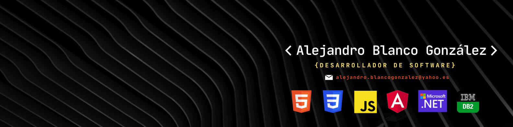

# Hola, mi nombre es Alejandro 👋
### Desarrollador de Software

Técnico Superior en Desarrollo de Aplicaciones Multiplataforma💻

Desarrollador de software con experiencia en el sector y un fuerte deseo de seguir aprendendiendo y creciendo en la industria tecnológica.

Actualmente trabajo como desarrollador full stack en *NttData* desde enero de 2024, participando en proyectos del entorno .NET y contribuyendo tanto en el backend como en el frontend.

🔎 Siempre estoy buscando mejorar mis habilidades y estar al día con las nuevas tecnologías del desarrollo web y multiplataforma.

## Tecnologías:

Y alguna más...

## Encuéntrame en:
  https://www.linkedin.com/in/ablancogon
